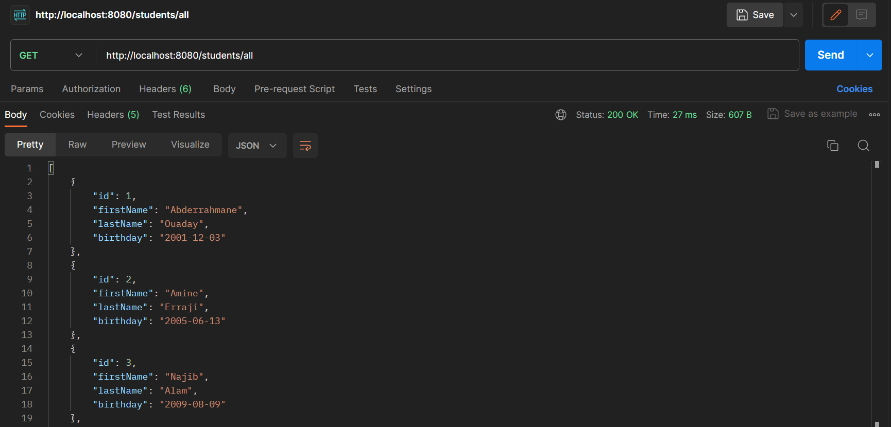
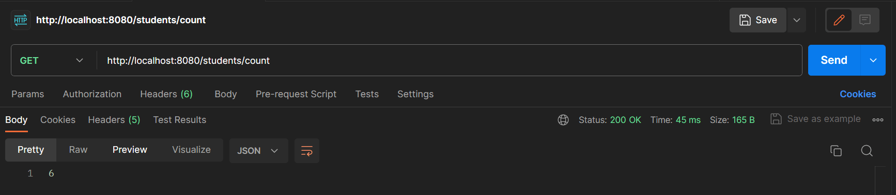
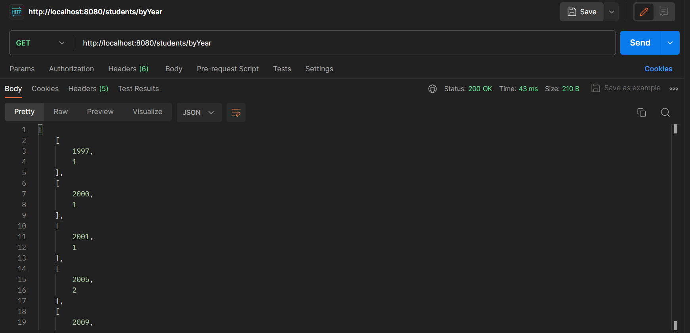
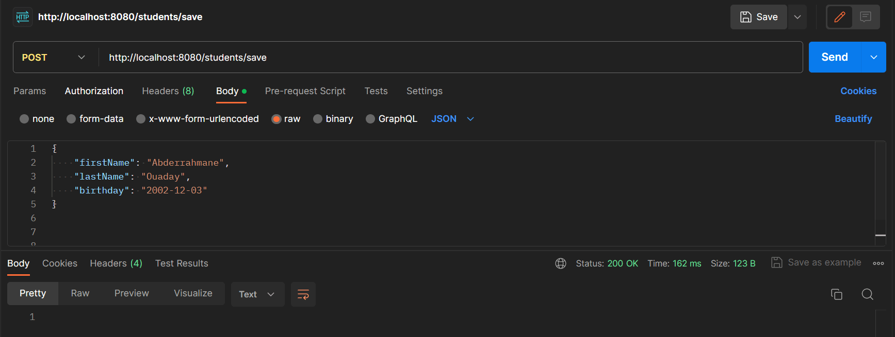
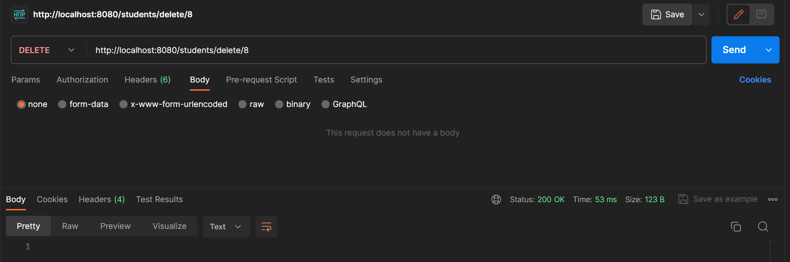

# Simple Boot Spring Project
This example requires a Web dependency, JPA, a REST repository, development tools and a MySQL driver.
## 1. Show all students

## 2. Number of students

## 3. Students by birthday

## 4. Create a new student

## 5. Delete a student using ID

